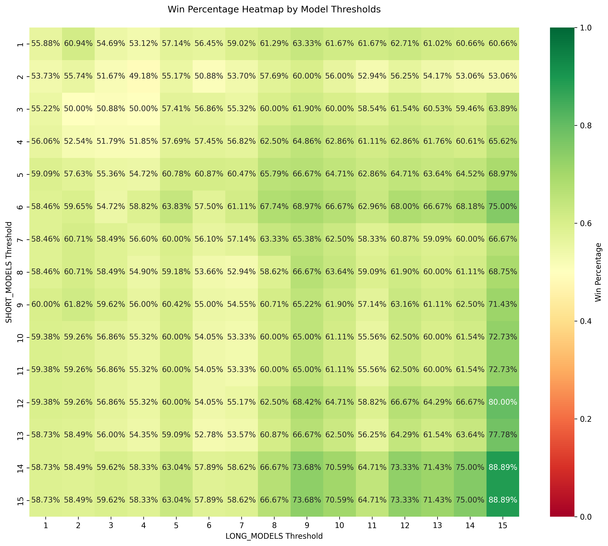

# Algorithmic NASDAQ Trading with Reinforcement Learning

## Project Overview
This project explores the application of reinforcement learning models from stable-baselines3 to predict NASDAQ ETF (QQQ) movements. After experimenting with various approaches, DQN (Deep Q-Network) models proved most effective for this trading strategy. The approach was to create multiple models, both for longs and shorts, and to only act (initiate a trade) when several models agree.

## Key Features
- Custom gym environment for financial market training
- Separate models for long and short position strategies
- Comprehensive validation methodology with held-out test sets
- Integration of technical indicators and options data
- Performance visualization through heatmaps and backtesting metrics

## Methodology
1. Created a custom OpenAI Gym environment to define the trading action space
2. Tested multiple reinforcement learning algorithms (PPO, A2C, DQN)
3. Implemented rigorous validation to minimize overfitting
4. Optimized hyperparameters based on backtesting performance
5. Evaluated models using standard trading metrics (Sharpe ratio, drawdown, etc.)

## Results

Our reinforcement learning models produced several key insights visualized below. Based on this, you can see as we scale up the number of models required to initiate a trade, the better our win rate gets. Overall performance may suffer a bit due to less total trades, and that's where the cumulative return performance plays a role in identifying an optimal combination of number of models to use.

### Win Percentage Analysis


### Trade Distribution


### Cumulative Return Performance


## Installation

```bash
pip install -r requirements.txt
